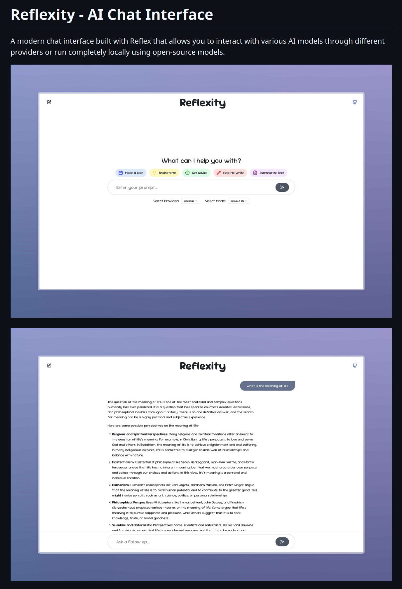

# Book Buddy

Have you ever tried to discuss a book with another person and accidentally spoiled a part for them, or vice versa? Book Buddy is here to save the day!

## Backstory

While trying to discuss "Wind and Truth" with my sister, I was telegraphing plot points that had not been as fully developed as my "future knowledge" remembered. When I made a few too many close calls I decided I should shut up and wait until she was fully caught up to me in the story.

I had done my best to recreate my knowledge of the chapter she was on, but my attempts were left lacking. Because I had read ahead, my perception of past events were colored. That's when I decided to create Book Buddy.

## Overview

"Book Buddy" is an innovative chatbot designed to offer readers a unique, spoiler-free book discussion experience. It accomplishes this by utilizing a knowledge graph to map book content in a structured way, allowing the chatbot to only discuss plot points the user has already read. This makes it perfect for readers who are keen to explore book analyses, themes, and details without the risk of encountering unwanted spoilers. Book Buddy is developed with a keen eye on creating a delightful user experience for both casual book lovers and an educational audience of students and teachers.


The primary objectives of Book Buddy are to foster engaging book discussions and deepen literary appreciation without revealing future story developments. By integrating with a robust technology stack, the project aims to ensure seamless, personalized user interactions across multiple books while maintaining data privacy and security. Success will be measured by user engagement, satisfaction, and the app’s ability to scale efficiently for broader use.

## Prerequisites

- python 3.8+
- reflex
- openai
- supabase

## Installation

1. Clone the repository:
```bash
git clone https://github.com/FocusedFidgeter/Book-Buddy.git
cd Book-Buddy
```

2. Set up Python environment with virtualenv:
```bash
python -m venv .venv

# On Unix or MacOS:
source .venv/bin/activate

# On Windows:
.venv\Scripts\activate
```

3. Install required packages:
```bash
pip install -r requirements.txt
```

## Configuration

> [!IMPORTANT]
> Before running the application, make sure to have the necessary API keys from the supported providers.

### Provider Configuration

The application uses `config.json` in the root directory to manage AI providers. To add or modify providers:

1. Open `config.json` and add your provider configuration:
```json
{
    "providers": {
        "your_provider_name": {
            "base_url": "https://api.your-provider.com/v1",
            "api_key": "YOUR_PROVIDER_API_KEY",
            "available_models": [
                "model-name-1",
                "model-name-2"
            ]
        }
    }
}
```

Required fields:
- `base_url`: The provider's API endpoint
- `api_key`: Environment variable name for the API key (except for local providers like Ollama)
- `available_models`: List of available models

The application will automatically detect and load any providers defined in this file.

### API Keys Setup

1. Set the following environment variables for your API keys:
```bash
# On Unix or MacOS:
export CEREBRAS_API_KEY="your_cerebras_api_key"
export HYPERBOLIC_API_KEY="your_anthropic_api_key"
export OPENAI_API_KEY="your_openai_api_key"

# On Windows:
set CEREBRAS_API_KEY=your_cerebras_api_key
set HYPERBOLIC_API_KEY=your_anthropic_api_key
set OPENAI_API_KEY=your_openai_api_key
```

2. Set the required models in `/app/api/api.py' for each of the providers:

```python
ModelProvider.OLLAMA: ModelConfig(
    base_url="http://localhost:11434/v1",
    api_key="ollama",  # required but unused
    available_models=["llama3.1:latest", "llama3.2:1b", "qwen2.5-coder:latest"],
),
```


## Running the Application

1. Run the development server:
```bash
reflex run
```

2. Open your browser and navigate to:
```
http://localhost:3000
```

## Usage

1. Select your preferred AI provider from the dropdown menu
2. Choose the model you want to use
3. Type your prompt in the input field
4. Click the send button
5. Your chat history will be displayed in the conversation view

## Contributing

1. Fork the repository
2. Create your feature branch (`git checkout -b feature/amazing-feature`)
3. Commit your changes (`git commit -m 'Add some amazing feature'`)
4. Push to the branch (`git push origin feature/amazing-feature`)
5. Open a Pull Request

## License

This project is licensed under the MIT License - see the LICENSE file for details

## Acknowledgments

- Built with [Reflex](https://reflex.dev/)

---

**Shout out to the foundation of Book Buddy:**

[Reflexity - AI Chat Interface](https://github.com/bm611/chat-ui)

A modern chat interface built with Reflex that allows you to interact with various AI models through different providers or run completely locally using open-source models.



